#  NSU 과팅 APP 💌


- ### 프로젝트 개요


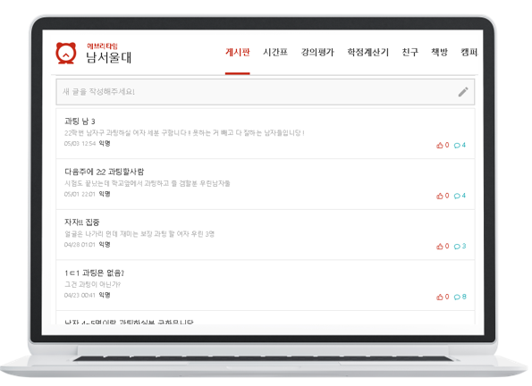


  - ⚡ [NSU 번개](https://www.nsu.ac.kr/)

  - `NSU 과팅 APP`은 2년동안의 코로나 시국에서의 인간관계의 결여를 탈피하기 위해 NSU 학생들만 사용할 수 있는 WEB기반의 APP서비스이다.

<br>
<br>
<br>

- ### 주요 기능 

  - **SSO 로그인 서비스**

    > 1) 우리학교인 남서울대학교 **학생포탈에 로그인이 가능한 사람**만 이용할 수 있도록 학생포탈의 토큰을 이용하여 APP에 로그인 서비스 구현.
    >
    > 2)  회원가입의 불편함을 덜기 위해, 학생포탈에서 사용하는 학번과 비번을 그대로 우리 APP에서 사용가능
    >
    > ​	- 사용자는 우리학교 학생들로만 이뤄진 집단이기때문에, 우리 APP에 대한 신뢰도가 증가함.

<br>
<br>
<br>


   
* **[기술 구현] :** 학생포탈로그인서비스에 로그인할 때 아이디 비번 값을 입력하는데,
                  id, password param값을 request해서 나온 응답코드 10000을 이용하여 
                  10000이 나올 경우 다음 페이지로 넘어가고 아닐 경우 리다이렉트 되도록 구현하였다.
                  


                  
```
@Controller
public class Certification {
   
   @Inject
   LoginService service;
   
   @Autowired
   private LoginService loginService;
   
   // 회원가입시 SSO 로그인 구현
   @RequestMapping(value = "/NSUOK", method = { RequestMethod.GET, RequestMethod.POST })
    public String paramTest(
          HttpServletRequest request,
           @RequestParam("id") String id,
            @RequestParam("password") String password,
            Model model,
            RedirectAttributes rttr,
            MemberInfo member
            )
            throws Exception {
        // 타임아웃 설정을 위해 HttpComponentsClientHttpRequestFactory 사용
        HttpComponentsClientHttpRequestFactory httpRequestFactory = new HttpComponentsClientHttpRequestFactory();
        httpRequestFactory.setConnectTimeout(3000);
        httpRequestFactory.setReadTimeout(5000);
        
        
        // 세션값(id) 유지 후 넘김. 
        HttpSession session = request.getSession();
        String name = id;
        session.setAttribute("id", name);
        ModelAndView mv = new ModelAndView();
        mv.setViewName(name);
        
        //인증확인
        
        String Class = request.getParameter("id");
        MemberInfo idCheck = loginService.idCheck(Class);
        
        int result1 = 0;
        
        if(idCheck != null) {
           result1 = 1;
        }

        HttpClient httpClient = HttpClientBuilder.create()
                .setMaxConnTotal(200)
                .setMaxConnPerRoute(20)
                .build();
        httpRequestFactory.setHttpClient(httpClient);
        // RestTemplate
        RestTemplate restTemplate = new RestTemplate(httpRequestFactory);
        // 파라미터 설정
        MultiValueMap<String, String> parameters = new LinkedMultiValueMap<>();
        parameters.add("id", id);
        parameters.add("password", password);
        // POST 호출
        String url = "https://sso.nsu.ac.kr/api/login";
        ResponseEntity<String> responseEntity = restTemplate.postForEntity(url, parameters, String.class);
        String body = responseEntity.getBody();
        ObjectMapper objectMapper = new ObjectMapper();
        Map result = objectMapper.readValue(body, Map.class);
        String resultCode = String.valueOf(result.get("code"));
        // 응답 코드 10000 - 성공
        if (resultCode.equals("10000") && result1 == 0) {
            System.out.println("인증 성공");
            service.potal(member);
            System.out.println(id);
            
            return "user/join";                       
        }if(resultCode.equals("10000") && result1 == 1) {
           System.out.println(result1);
           return "user/login";
           
        }else {
            System.out.println("인증 실패");
            rttr.addFlashAttribute("msg", false);
            return "redirect:/NSU";
        }

    }
   
   
   }

   ```
  
   

  - **게시판 등록 및 신청** 

    > 1)  사용자들은 자신의 소소한 개인정보(나이, MBTI, 주량)등이 포함된 게시글을 작성한다. 
    >
    > 2)  마음에 드는 게시글에 들어가서 친구신청 버튼을 클릭한다. 
    >
    
    
    
    

  - **친구 수락 및 등록**

    > 1) 친구수락 신청이 오면, 사용자는 수락이나 거절버튼을 활용할 수 있다.
    >
    > 2) 수락을 눌러 서로 친구상태가 되면, 친구 목록에 추가된다.
    >
    > 3) 서로 친구인 상태에서는 서로의 KAKAOTALK ID를 자동으로 교환할 수 있다.
    >

- ### 향후 계획


  - **사용자 프로필** : 현재 우리 프로젝트에서 보여지고 있는 단순한 프로필이 아닌 사진이나 여러 소스들이 포함된 다채로운 프로필
  - **채팅 기능** : 우리 APP에서 KAKAOTALK ID를 교환해주는 방식이 아닌, APP자체의 채팅서비스로 사용자들로 하여금 편의를 제공
  - **데이터베이스 암호화** : 사용자들의 정보가 데이터베이스에 담길 때, BCyptPasswordEncoder을 활용한 암호화 작업
  - **APP Design** : 우리 APP만의 정체성을 지닌 총체적 디자인 개편 


## 📌 목차

[Run With Me ? 🏃](#triangular_flag_on_post-run-with-me--%EF%B8%8F) 

* [사용된 도구](#hammer_and_wrench-사용된-도구)

* [서비스 소개](#-서비스-소개)

* [저자](#-저자)

* [라이센스](#page_with_curl-라이센스)

  


## :hammer_and_wrench: 사용된 도구


**[ TEAM Cooperation ]**

- **GitHub** : GitHub을 활용하여 프로젝트를 관리.
  - Git Flow 에 따른 브랜치 전략 수립.
  
- **Slack** : 협업을 위한 공용 문서 및 산출물들을 공유할 수 있도록 활용.
  - 동시 문서 작성
  - 대용량 파일 첨부

## 🎞 서비스 소개

### 0. 회원가입 화면

#### 0-1. 회원가입 화면

 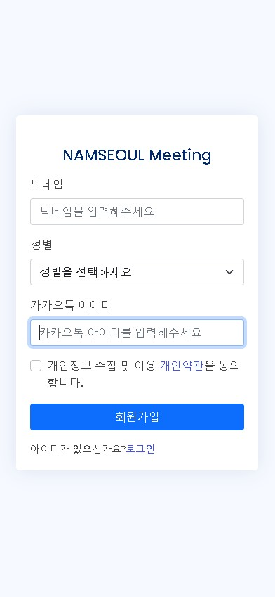 

- **[회원가입 화면] :** NSU 학생포탈의 학번과 비밀번호를 활용하여 본교생인지를 인증 후 인증이 완료된 학우들에게만 인적사항을 기재할 수 있는 페이지로 넘겨준다.


### 1. 로그인 화면

#### 1-1. 로그인 화면

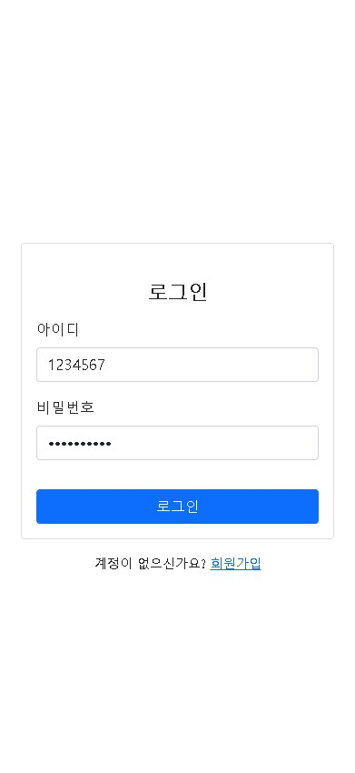


---

### 2. 메인 화면

#### 2-1. 메인 화면

  

- **[메인 화면] :** 로그인 전(메인화면) / 로그인 후(메인화면)

---

#### 2-2. 메인 화면에서 1:1 미팅 클릭

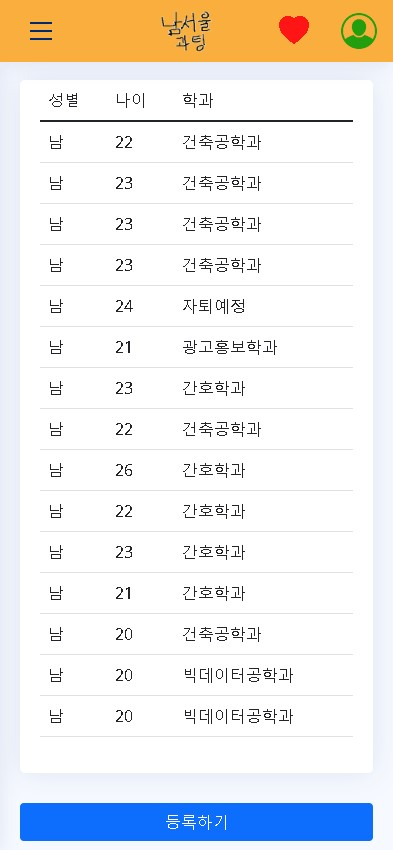 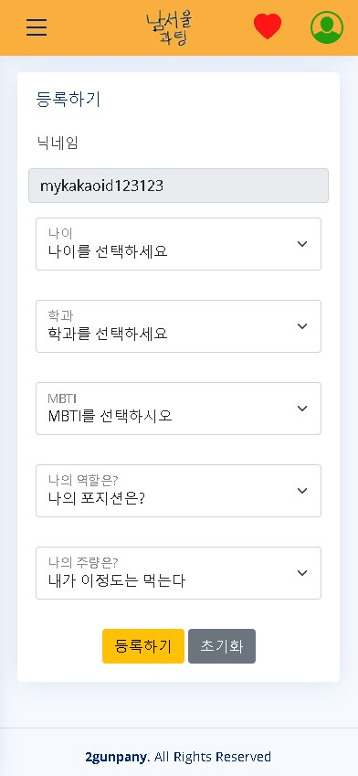  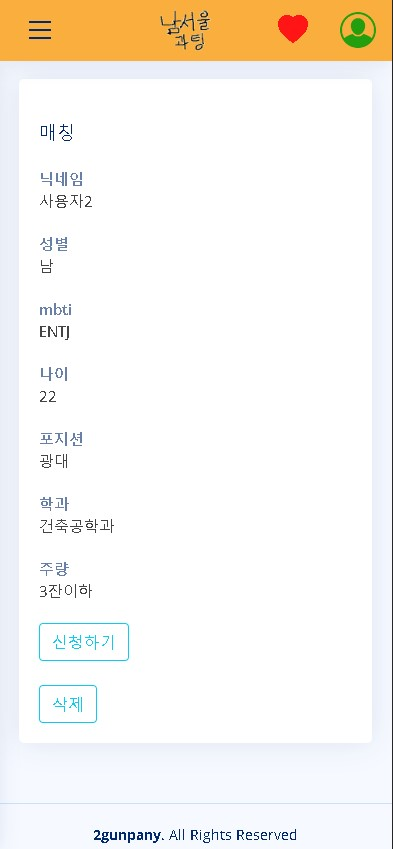

- **[메인 화면에서 1:1 미팅 클릭시] :** 유저들이 작성한 게시글을 보여준다.
- **[게시글에서 등록하기 버튼 클릭시] :** 유저의 소소한 개인정보들을 입력할 수 있는 폼을 보여준다.
- **[게시글 클릭시] :** 다른 유저가 입력해놓은 개인정보들을 확인할 수 있는 페이지가 보여진다.
---

#### 2-3. 마음에 드는 유저에게 친구신청 보내기

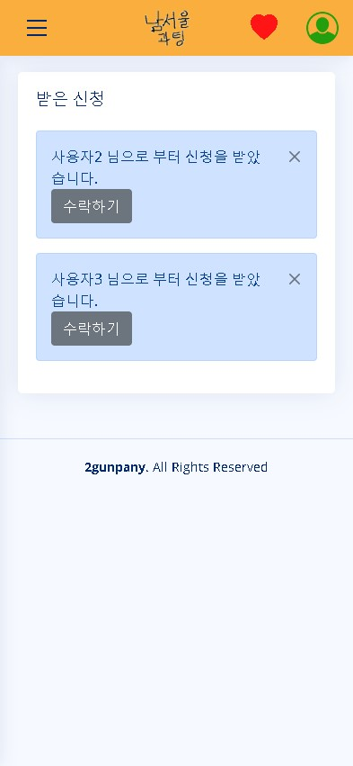 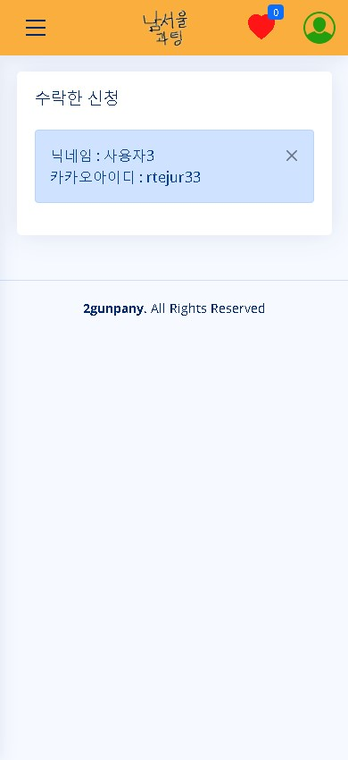

* **[다른 유저에게 친구신청을 받을 때] :** 다른 유저가 친구 신청버튼을 누르면 신청 폼이 날라온다.
* **[다른 유저의 친구신청을 수락할 때] :** 수락한 친구의 목록을 볼 수 있는 페이지를 볼 수 있다.

---

### 3. 프로필

#### 3-1. 프로필 설정

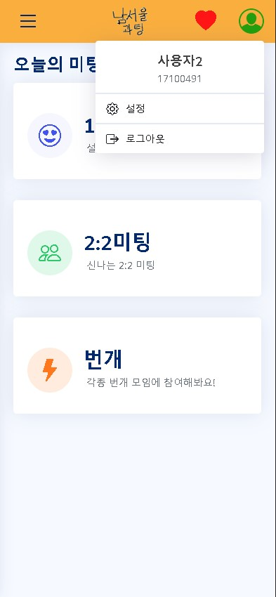  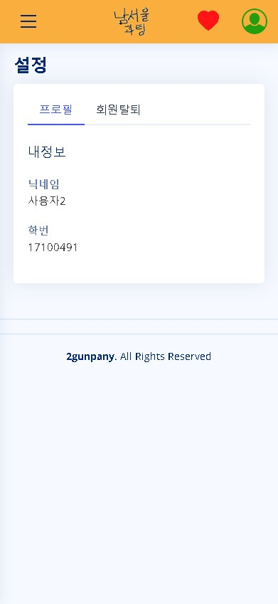  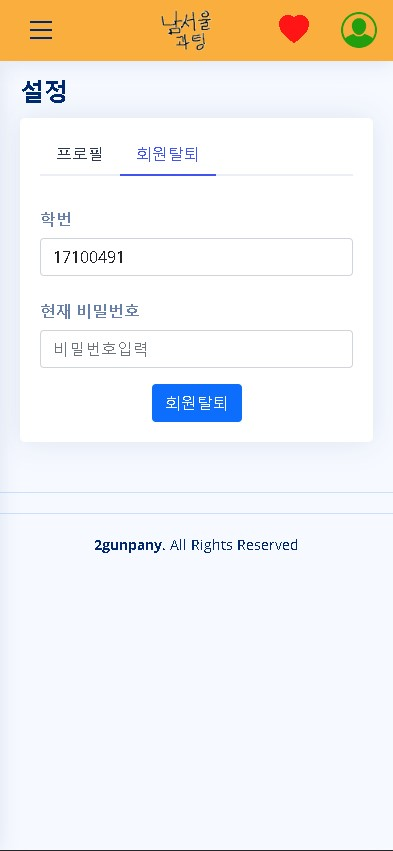

* **[프로필 설정] :** 회원가입 시 기재한 인적사항 확인 및 변경.
* **[회원 탈퇴] :** 현재 비밀번호 입력 후, 입력한 비밀번호가 현재의 비밀번호와 일치하면 탈퇴.


---

#### 3-2. 관리자 로그인 및 회원 목록

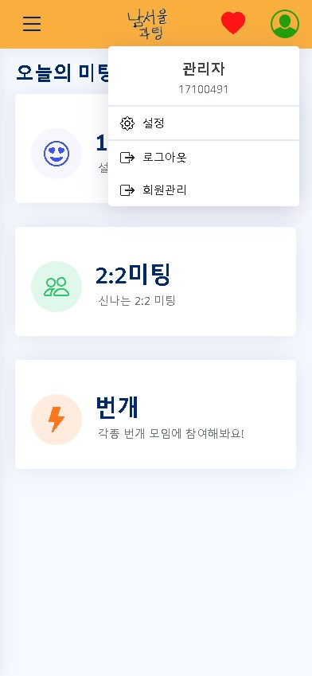 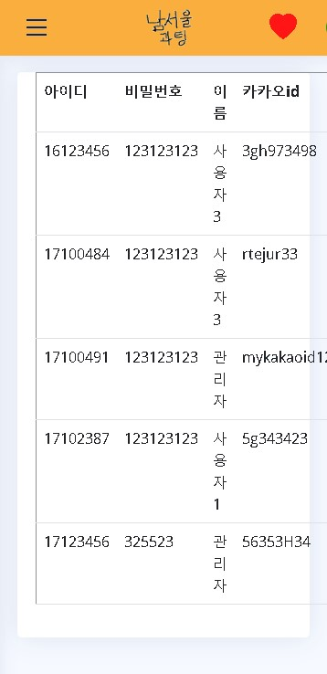 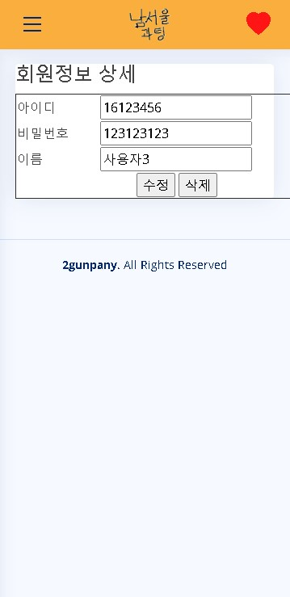


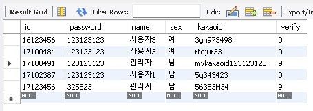

* **[관리자 모드] :** Verify가 9로 지정된 관리자모드에서는 회원들을 관리 수정 삭제 할 수 있다.

---


---


## 👤 저자

* 이건 - Lee Gun - LeeGun@naver.com - @[imdaeyong](https://github.com/imdaeyong) [Back/PL]
* 전민우 - Jeon Min Woo - JeonMinWoo@gmail.com - @[kkmwkk](https://github.com/kkmwkk) [Back]
* 안형관 - An Hyeong Kwan - AnHyeongKwan@gmail.com - @[hyungtaik](https://github.com/hyungtaik) [Back]
* 정슬필 - Jeong Seung Pil - JeongSeungPil@gmail.com - @[LEESUNSOO](https://github.com/LEESUNSOO) [Front]
